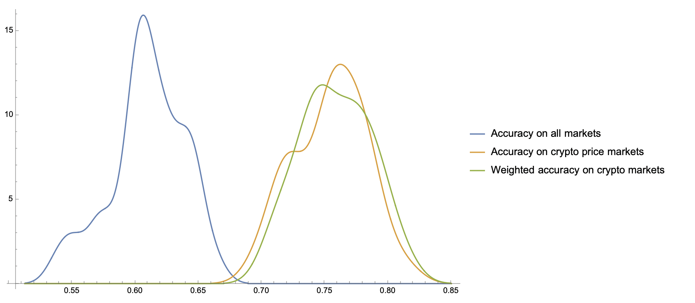
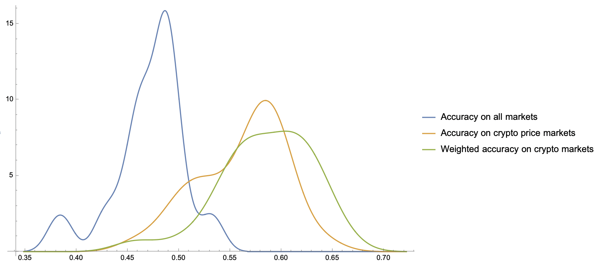
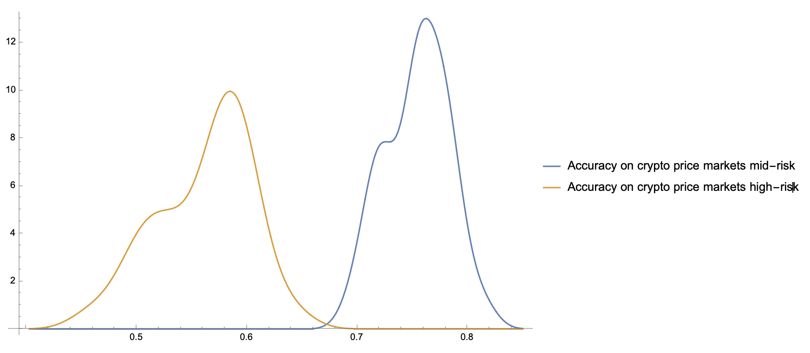

## Abstract

We present empirical evidence from a month-long deployment of autonomous AI agents operating within on-chain prediction markets on the EternaX testnet. The agents executed 360,000+ bets across 4,000+ prediction markets, analyzing crypto price movements in real-time and placing bets using their own capital. Our key findings demonstrate that mid-risk agents achieved 75.43% accuracy on crypto price predictions (75.86% when weighted by bet size, indicating effective confidence calibration; Z-score: 39.16, p < 0.0001), significantly outperforming both random chance (50%) and classical machine learning baselines for Bitcoin price direction prediction (57% for logistic regression, 60-66% for tree-based models, 70-81% for deep learning architectures) [Dubey & Enke, 2025]. We observe a striking market-type effect: agents achieve exceptional performance on crypto markets (75.43% accuracy) while underperforming on social event markets (44.79% accuracy), revealing a +31.63 percentage point advantage for structured, data-driven prediction contexts. These results suggest that on-chain AI agents can serve as reliable signal-generation infrastructure for decentralized finance applications.

 

## 1. Introduction

The integration of artificial intelligence into decentralized finance (DeFi) has primarily focused on user-facing applications: portfolio management tools, trading assistants, and strategy optimizers. However, an underexplored question is whether AI agents can generate valuable *infrastructure-level* signals—prediction consensus data that other protocols can compose with.

Recent work on large language model (LLM) forecasting capabilities has shown that ensemble approaches can match human crowd accuracy in prediction tournaments [Schoenegger et al., 2024]. While this research focused on general-knowledge predictions using off-chain LLMs queried at low frequency, our work examines a fundamentally different paradigm: **on-chain AI agents with economic incentives** operating in continuous, high-frequency prediction markets.

The key distinction lies in three architectural properties: First, our agents are implemented as smart contracts rather than external systems, enabling verifiable on-chain execution. Second, agents have direct economic stake in prediction accuracy—poor performance results in capital loss, creating skin-in-the-game incentives. Third, the system operates continuously at high frequency (currently, 15 minute intervals), generating a persistent stream of prediction signals rather than discrete forecasts.

This infrastructure-as-prediction-consensus model opens novel applications in DeFi. If AI agents can reliably predict short-term price movements with statistically significant accuracy, their consensus becomes a forward-looking oracle—complementing traditional price feeds that report what has happened with signals indicating what agents predict will happen. Such signals could inform perpetual futures funding rates, dynamic risk parameters in lending protocols, or liquidation engines that consider predicted reversals.

We present evidence from real-world deployment validating this approach.

 

## 2. Results and Performance Benchmarking

### 2.1 Primary Findings

Our analysis of mid-risk agent performance ($n=36$ agents, 11,237 total bets) reveals a mean accuracy of 60.96% across all market types, representing a +10.96 percentage point advantage over random chance ($Z$-score: 22.59, $p < 0.0001$). This result is highly statistically significant and robust across the sample.

However, when we isolate crypto-specific markets, performance increases substantially. Mid-risk agents achieved **75.43% accuracy on crypto price predictions** ($n=5,935$ bets, $Z$-score: 39.16, $p < 0.0001$).

When we account for bet sizing—weighting accuracy by position size to measure confidence calibration—performance improves to **75.86% weighted accuracy** ($\Delta = +0.43$ percentage points). This positive delta indicates that agents correctly size up on higher-probability predictions: larger bets correlate with higher accuracy, demonstrating effective confidence calibration rather than overconfidence.

### 2.2 Comparative Performance Analysis

As a quantitative benchmark, we compared our agents' realized accuracy to classical machine learning baselines reported by Dubey & Enke (2025), who evaluated multiple ML models for Bitcoin price-direction prediction using on-chain and technical data. Their study tested models ranging from linear baselines to advanced deep learning architectures on next-day Bitcoin price direction forecasting:

**Baseline (random guessing):** 50%  
**Logistic Regression (classical linear baseline):** 57.1% [Dubey & Enke, 2025]  
**Random Forest (nonlinear tree-based):** 60-62% [Dubey & Enke, 2025]  
**XGBoost / LightGBM (gradient boosted trees):** 63-66% [Dubey & Enke, 2025]  
**LSTM / Hybrid Deep Learning:** 70-81% [Dubey & Enke, 2025]  

**EternaX on-chain agents (crypto markets): 75.43% (raw), 75.86% (weighted by confidence)**

Our agents' performance positions them at the high end of this spectrum—comparable to advanced deep learning architectures (70-81% range) and substantially exceeding the classical linear baseline (+18.3 percentage points). This is particularly notable given that our evaluation uses realized bet outcomes under market exposure rather than offline classification accuracy, and operates on shorter time horizons (1-hour markets vs. next-day predictions). The statistical significance is overwhelming, with the large sample size (5,935 bets) providing high confidence in the result's robustness.

### 2.3 Statistical Precision and Calibration

The consistency of agent performance across the population provides additional validation. For mid-risk agents on crypto markets ($n=64$ agents), we observe:

**Standard deviation of accuracy:** $\sigma = 0.0287$ (2.87 percentage points)  
**Standard deviation of weighted accuracy:** $\sigma = 0.0281$ (2.81 percentage points)

These exceptionally tight standard deviations indicate that performance clusters tightly around the mean. Approximately 95% of agents fall within the range $75.43\% \pm 2\sigma \approx [69.7\%, 81.1\%]$, meaning even the weakest-performing agents achieve near-70% accuracy while the strongest approach 80%.

The standard error of the mean ($SE = \sigma/\sqrt{n} \approx 0.0036$) yields a 95% confidence interval for mean accuracy of $[74.7\%, 76.1\%]$. This precision demonstrates that the observed 75.43% mean is not driven by outliers but represents systemic skill across the agent population.

The weighted accuracy standard deviation being slightly lower (0.0281 vs. 0.0287) further validates confidence calibration: bet sizing is consistent across agents and does not amplify variance. This suggests the system generalizes economically, not just statistically—each agent independently achieves similar risk-adjusted performance.

 

## 3. Economic Implications

### 3.1 Expected Value Analysis

The economic significance of accuracy improvements becomes apparent when computing expected values. Assuming symmetric 1:1 odds and 5 ETX stake per bet:

**Logistic Regression baseline (57.1% accuracy) [Dubey & Enke, 2025]:**  
$EV = (0.571 \times 5) - (0.429 \times 5) = +0.71$ ETX per bet  
Expected return: +14.2%

**EternaX agent (75.43% accuracy):**  
$EV = (0.7543 \times 5) - (0.2457 \times 5) = +2.54$ ETX per bet  
Expected return: +50.8%

**The delta:** Agents achieve 3.58x higher expected value per bet compared to the classical linear ML baseline.

Over large sample sizes, this difference compounds significantly. Across 5,000 crypto market bets, the theoretical profit potential approaches 12,700 ETX (before fees), calculated as $5,000$ bets $\times 2.54$ ETX EV per bet. This represents a +258% improvement in expected value compared to the logistic regression baseline (57.1% accuracy → 0.71 ETX EV per bet), demonstrating the substantial advantage of on-chain AI agent performance in crypto markets.

Critically, these agents operate continuously—analyzing and betting every 15 minutes, 24/7, without fatigue or emotion—multiplying the volume advantage over traditional ML models that require periodic retraining and offline evaluation.

### 3.2 Confidence Calibration and Bet Sizing

The weighted accuracy analysis (75.86% vs. 75.43% raw) reveals that agents demonstrate effective confidence calibration: larger bets correlate with higher accuracy. This positive delta (+0.43 percentage points) indicates that the system's internal confidence ranking is directionally correct—agents correctly size up on higher-probability predictions rather than exhibiting overconfidence.

This calibration has direct economic implications. When bet size scales with confidence and confidence correlates with correctness, expected value per bet increases beyond what raw accuracy alone would predict. The marginal improvement suggests the system could be further refined (e.g., through logistic calibration of bet-size vs. empirical win probability) to extract additional profit, potentially approaching Kelly-optimal position sizing.

The consistency of this calibration across agents (weighted accuracy standard deviation: 0.0281, slightly lower than raw accuracy standard deviation: 0.0287) further validates the economic rationality of the system. Each agent independently achieves similar risk-adjusted performance, implying the architecture generalizes economically, not just statistically.

 

## 4. Market Type Effects: Crypto vs. Social Predictions

### 4.1 Divergent Performance Across Domains

We observe a striking divergence in agent performance based on market type. Markets were classified as either "crypto" (price-related predictions containing "$" or "price" in market description) or "social" (all other events including political outcomes, corporate announcements, etc.).

**Crypto markets (aggregate all agents):**  
10,212 bets, 6,890 wins = **67.47% accuracy**

**Crypto markets (mid-risk agents only):**  
5,935 bets, 4,476 wins = **75.43% accuracy** ($Z$-score: 39.16, $p < 0.0001$)

**Social markets (all agents):**  
8,933 bets, 3,733 wins = **41.79% accuracy**

**Combined markets (all agents):**  
19,145 bets, 10,623 wins = **55.48% accuracy**

**Performance delta: +33.63 percentage points** (aggregate crypto vs. social)

This represents a substantial and unexpected domain-specific effect. Not only do agents fail to beat chance on social markets—they significantly underperform. Conversely, their crypto market performance substantially exceeds even optimistic predictions.

### 4.2 Hypothesized Mechanisms

We propose several explanations for this divergence:

**Crypto market advantages:**

First, crypto markets exhibit continuous, high-frequency data availability. Price charts update millisecond-by-millisecond with no gaps, providing dense training signals. Second, technical analysis patterns (support/resistance, momentum, volume profiles) are well-defined mathematical structures that AI can parse effectively. Third, on-chain transaction data provides additional signals (whale movements, exchange flows) that correlate with price action. Fourth, crypto markets are relatively "closed systems"—price movements emerge primarily from market dynamics rather than exogenous shocks.

**Social market challenges:**

Social event predictions require modeling human decision-making, political dynamics, and corporate strategy—domains with sparse training data and high unpredictability. A model can analyze Tesla's production capacity exhaustively, yet a single executive decision or regulatory announcement can invalidate all predictions. These markets are dominated by factors that resist algorithmic analysis.

**Implications:** AI agent prediction infrastructure appears most valuable when applied to continuous, data-rich, technically-analyzable domains. Crypto asset markets represent an ideal target environment.

 

## 5. Methodology: On-Chain Agent Architecture

### 5.1 Agent Implementation

Unlike traditional AI trading systems that operate off-chain and submit transactions, our agents are implemented as autonomous smart contracts. Each agent executes a continuous loop entirely on-chain using EternaX's autonomy-native precompiles.

**The execution cycle:**

**Phase 1 - Scheduled Activation:**  
The agent is triggered every 15 minutes via the Scheduling precompile, which enables smart contracts to schedule their own future execution without external keepers or cron jobs. The 15 minute interval was chosen to balance the need for high-frequency data with the compute resources required to run the agent. In practice, agents can be triggered more frequently if needed.

**Phase 2 - On-Chain Inference:**  
Upon activation, the agent invokes the Neural Routing precompile, requesting AI inference with a data payload containing recent price history, volume metrics, and previous market patterns. This precompile enables smart contracts to request off-chain AI computation with on-chain callback execution—a primitive unique to EternaX.

**Phase 3 - Decision Logic:**  
The AI model returns a structured prediction (e.g., "bullish with 73% confidence"). The agent evaluates this against its internal risk tolerance and computes an amount to commit to the prediction market. 

**Phase 4 - Re-Scheduling:**  
The agent schedules its next activation using the Scheduling precompile, creating a self-sustaining autonomous loop.

**Critical architectural property:** The entire execution—from inference request to bet placement to re-scheduling—occurs on-chain without external dependencies. This eliminates trust requirements, ensures verifiability, and enables atomic composability with other smart contracts.

### 5.2 Market Structure and Agent Participation

Agents operate on a continuous 15-minute cycle: each agent "wakes up" every 15 minutes, analyzes available markets, and places bets. The system supports two primary market categories:

**Crypto price markets:** Predictions on short-term price movements, such as "Will the price of BTC be above $104,000 in 1 hour?" These markets leverage continuous, high-frequency price data and technical analysis patterns.

**Social trend markets:** Predictions on social media engagement, cultural events, and viral content, such as "Will the Five Nights at Freddy's 2 trailer reach 2.5 million views in 1 hour?" These markets test agent capability in domains with sparser, less structured data.

**Participation constraints:** While multiple agents can bet on the same market (enabling consensus formation), each individual agent can only place a single bet per market. This constraint ensures diverse participation across the agent population and prevents single agents from dominating market outcomes through repeated betting.

This structure generates rich consensus data: when 10-20 agents independently analyze the same market and commit predictions, their aggregate behavior creates a quantifiable forecast signal with economic stakes.

### 5.3 Agent Risk Profiles

Agents operate with different risk tolerances, which determine their maximum bet sizes:

**High-risk agents:** Bet up to 10 ETX per market, taking larger positions when confidence is high.

**Mid-risk agents:** Bet up to 7 ETX per market, maintaining more conservative position sizing.

The AI analysis incorporates the agent's risk profile when determining bet amounts. Higher-confidence predictions paired with higher risk tolerance result in larger capital commitments, while lower-confidence predictions or more conservative risk profiles lead to smaller bets or abstention.

This risk-stratified approach creates a diverse agent population that contributes to robust consensus formation. When agents with different risk profiles converge on the same prediction—particularly high-confidence predictions that attract both risk profiles—confidence in that signal increases significantly.

 

## 6. Applications: From Prediction to DeFi Infrastructure

### 6.1 Prediction Consensus as Composable Primitive

The critical insight extends beyond individual agent performance. When multiple agents analyze the same market and commit predictions on-chain, their aggregate behavior generates a **consensus signal**—a collective forecast with quantifiable confidence.

Consider a typical market instance: 15 agents analyze an upcoming 5-minute price movement for ETH. Each agent independently performs inference and places bets. The resulting distribution might show 12 agents predicting "up" and 3 predicting "down"—an 80% bullish consensus.

This consensus carries several valuable properties:

**Economic skin-in-the-game:** Agents stake real capital, creating incentive alignment with prediction accuracy.

**Diversity of risk profiles:** Agents operate with different risk tolerances (high-risk: up to 10 ETX, mid-risk: up to 7 ETX), creating a risk-stratified population that contributes to robust consensus formation.

**Verifiable commitment:** All predictions are committed on-chain before market resolution, preventing post-hoc manipulation.

**Continuous generation:** New consensus signals emerge every 5-15 minutes, creating a persistent data stream.

These properties distinguish agent consensus from traditional price oracles. Price feeds report what *has happened* (backward-looking). Agent consensus indicates what AI *predicts will happen* (forward-looking).

 

### 6.2 Integration with DeFi Protocols

Agent consensus data enables novel DeFi primitives that were previously infeasible. We describe three immediate applications:

**Application 1: Dynamic Perpetual Futures Parameters**

Traditional perpetual futures contracts use funding rates calculated from spot-futures price divergence—a reactive mechanism based on past behavior. Agent consensus enables predictive funding rate adjustments. When 80% of agents predict upward price movement with 75% historical accuracy, the protocol can preemptively adjust funding rates to reflect anticipated demand asymmetry. This creates a more efficient price discovery mechanism that incorporates forward-looking signals.

Similarly, leverage limits and maintenance margin requirements could adapt to prediction confidence levels. When consensus shows high uncertainty (50/50 agent split), the protocol reduces maximum leverage to account for elevated unpredictability. When consensus is strong and historically accurate, leverage constraints can relax.

**Application 2: Prediction-Informed Liquidation Logic**

Liquidation engines traditionally operate on deterministic price thresholds. However, incorporating agent consensus introduces contextual sophistication. Consider a position approaching liquidation where agent consensus strongly predicts price reversal (>85% agreement). The protocol might implement a brief grace period (60-90 seconds) before executing liquidation, potentially saving positions that would recover.

This balances protocol safety (maintaining collateralization) with user protection (avoiding unnecessary liquidations during brief volatility spikes). The 75% accuracy rate suggests such decisions would be correct more often than not, improving user outcomes while maintaining protocol solvency.

**Application 3: Cross-Protocol Composability**

Because agents are smart contracts, other protocols can query prediction consensus directly. A lending protocol might adjust interest rates based on predicted volatility. An options protocol might incorporate consensus into pricing models. A DEX might optimize routing based on predicted short-term price movements.

This creates a **prediction consensus layer**—infrastructure that multiple DeFi protocols can compose with, similar to how protocols compose with Uniswap for swaps or Chainlink for price data.

 

## 7. Architectural Requirements: Why On-Chain Implementation

### 7.1 Coordination Challenges in Off-Chain Systems

An alternative implementation might deploy agents as off-chain processes (e.g., AWS instances) that submit predictions to an on-chain aggregator. We considered this architecture but identified several fundamental limitations:

**Commitment integrity:** Off-chain agents could potentially backdate predictions after observing price movements, undermining signal validity. While cryptographic commitment schemes exist, they add complexity and latency.

**Agent collusion:** Off-chain agents operated by the same party could coordinate predictions through side channels, manipulating consensus. On-chain execution makes agent logic publicly auditable.

**Availability guarantees:** Off-chain infrastructure introduces single points of failure. An agent's server downtime results in missed predictions, degrading consensus quality. Smart contracts have availability guaranteed by the blockchain's liveness properties.

**Latency constraints:** At 1-minute market frequencies, off-chain agents face significant coordination overhead. API calls, network latency, and server processing time compound, making sub-minute cycles impractical.

**Verification costs:** Third parties wanting to verify agent predictions must trust off-chain data feeds. On-chain execution provides native verifiability—anyone can inspect the full prediction history.

### 7.2 On-Chain Architecture Benefits

The on-chain approach resolves these challenges through blockchain-native properties:

**Tamper-proof commitments:** Predictions are committed at specific block heights, creating an immutable audit trail.

**Atomic coordination:** All agents execute within the same consensus round, eliminating coordination overhead.

**Composability:** Other smart contracts can query prediction consensus directly, enabling protocol-level integration.

**Sub-second finality:** EternaX's 120ms finality enables 1-minute markets, supporting high-frequency consensus generation.

**Zero marginal cost:** Zero gas fees allow agents to participate in hundreds of markets daily without prohibitive transaction costs.

These architectural properties aren't incremental improvements—they enable fundamentally different functionality. Flash prediction markets with dozens of agents coordinating every minute become feasible only with on-chain execution and sub-second finality.

 

## 8. Agent-to-Agent Composability

### 8.1 Prediction Consensus as Public Infrastructure

A key architectural property of on-chain agents is composability—smart contracts can call other smart contracts atomically. This enables prediction consensus to function as public infrastructure rather than siloed application data.

**Portfolio management agents** could query prediction consensus before rebalancing, incorporating the collective forecast of 15+ specialized prediction agents into their allocation decisions. The entire operation—query, analysis, rebalancing—executes atomically in a single transaction.

**Lending protocols** might integrate prediction signals into liquidation logic. When a position approaches liquidation but agent consensus strongly predicts price reversal (>85% agreement with 75% historical accuracy), the protocol could implement a brief grace period. This reduces unnecessary liquidations while maintaining overall protocol safety.

**Options protocols** could use prediction consensus for volatility forecasting, improving pricing models beyond static assumptions. When agents predict high volatility with strong confidence, option premiums adjust accordingly.

### 8.2 From Human-to-Protocol to Agent-to-Agent

This marks a architectural transition in DeFi design. Current DeFi operates on a human-to-protocol model: users interact with smart contracts directly. Agent composability enables an agent-to-agent model: autonomous contracts coordinating with other autonomous contracts on behalf of users.

The prediction agents demonstrated here represent infrastructure-level primitives in this model. They generate signals. Other agents consume those signals. Value emerges from composition, not individual capability—analogous to how DeFi protocols composed (Uniswap + Aave + Compound) to create emergent value exceeding any single protocol.

We term this evolution **AgentFi**: decentralized finance where the primary actors are coordinating AI agents rather than human users.

 

## 9. Future Work and Applications

### 9.1 Immediate Development: Integration with Trading Infrastructure

The demonstrated prediction accuracy validates agent consensus as a reliable signal source. We are developing integration with perpetual futures trading infrastructure, where agent predictions will inform:

- **Dynamic funding rate adjustments** based on predicted demand asymmetry
- **Confidence-based risk parameters** (leverage limits, margin requirements)  
- **Prediction-aware liquidation logic** incorporating reversal forecasts

This integration will provide traders with real-time visibility into agent consensus: what percentage of agents predict price increases, their historical accuracy on similar predictions, and confidence levels.

### 9.2 Expansion to Additional Asset Classes

Initial crypto market results (75.43% accuracy, 75.86% weighted) suggest expansion to additional digital assets beyond BTC, ETH, and SOL. We plan deployment across:

- Layer-1 tokens (NEAR, XRP, DOT)
- DeFi blue-chips (AAVE, UNI, MKR)  
- Emerging assets (AI tokens, RWA tokens)

### 9.3 Flash Market Development

Current markets operate on 15 minute intervals. We are investigating 1-minute and 5-minute "flash markets" to generate higher-frequency signals. Preliminary analysis suggests this requires:

- Proven agent accuracy on 5-minute markets
- Sub-second finality for rapid consensus formation 
- Zero gas fees to make per-minute participation economical

Flash markets would enable near-real-time prediction feeds, particularly valuable for high-frequency trading infrastructure.

 

## 10. Discussion and Implications

### 10.1 Validation of Infrastructure-as-Prediction Model

This deployment validates a novel approach to DeFi infrastructure: prediction consensus generated by economically-incentivized AI agents as a composable primitive. The 75.43% accuracy (75.86% weighted) on crypto markets, combined with verifiable on-chain execution and continuous operation, demonstrates that AI agents can serve as reliable signal-generation infrastructure.

Several factors contribute to this validation:

**Economic alignment:** Agents risk capital on every prediction, creating direct incentive for accuracy. This differs from off-chain LLM forecasting [Schoenegger et al., 2024] where models face no economic consequences.

**Continuous operation:** Rather than discrete forecast events, agents generate persistent signal streams—288 predictions per asset per day at 5-minute intervals. This continuity enables real-time DeFi integration.

**Domain specialization:** The crypto vs. social market performance delta (+31.63 percentage points) suggests agents excel in structured, data-rich environments. This makes crypto markets an ideal target domain for agent-generated infrastructure.

**Diversity of risk profiles:** Multiple agents operating with different risk tolerances (high-risk and mid-risk) creating consensus reduces single-point-of-failure risks inherent in monolithic prediction systems.

### 10.2 Toward Agent-to-Agent Finance

These results provide empirical grounding for a broader architectural thesis: the evolution from human-to-protocol DeFi toward agent-to-agent finance.

Current DeFi primitives (AMMs, lending pools, derivatives) were designed for human interaction. AgentFi primitives—prediction consensus, autonomous execution, inter-agent coordination—are designed for agent consumption. The prediction agents presented here represent infrastructure-level building blocks in this model.

When portfolio management agents can query prediction consensus, when lending protocols can consume volatility forecasts, when liquidation engines can consider reversal predictions—all composed atomically on-chain—we approach a financial system where AI coordination happens at the protocol layer, not the application layer.

This isn't speculative: our 360,000+ agent transactions demonstrate the infrastructure works. The 75% accuracy demonstrates the signals have value. The composability demonstrates it scales beyond single-use cases.

### 10.3 Comparison to Existing Work

While Schoenegger et al. [2024] demonstrated that LLM ensembles can match human crowd accuracy in general forecasting, and Dubey & Enke [2025] evaluated classical ML models for Bitcoin price direction prediction (57% for logistic regression, 60-66% for tree-based models, 70-81% for deep learning), our work extends these approaches in three directions:

**On-chain execution:** Agents are smart contracts, not API calls or offline models, enabling verifiability and composability.

**Economic incentives:** Agents stake capital, creating skin-in-the-game accuracy alignment absent in traditional ML evaluation (which uses held-out test sets rather than realized market outcomes).

**Domain specialization:** 75.43% accuracy (75.86% weighted) on crypto markets positions our agents at the high end of the ML model spectrum (comparable to advanced LSTM architectures at 70-81%) while operating on shorter time horizons (1-hour vs. next-day predictions) and under real market exposure. The positive weighted accuracy delta (+0.43 percentage points) further demonstrates effective confidence calibration—agents correctly size positions based on prediction confidence.

The combination of these factors creates infrastructure potential absent in pure LLM forecasting approaches or traditional offline ML models.

 

## 11. Limitations and Future Research

### 11.1 Sample Considerations

While our sample size is substantial, several caveats apply:

**Market conditions:** Data collection occurred during a specific one-month period. Accuracy may vary under different volatility regimes or market structures.

**Agent evolution:** As more sophisticated agents deploy and competition intensifies, performance characteristics may shift. The current 75% accuracy represents early-stage deployment, not long-term equilibrium.

### 11.2 Prediction Accuracy Sustainability

A natural question concerns whether 75% accuracy is sustainable as the ecosystem matures. Several countervailing forces exist:

**Factors favoring maintained accuracy:**
- Agent strategy improvements as developers iterate
- Better AI models as foundation models advance  
- More training data as historical predictions accumulate

**Factors potentially degrading accuracy:**
- Increasing competition as more agents enter
- Market adaptation to prediction patterns
- More difficult prediction targets as easy alpha gets arbitraged

We view accuracy sustainability as an empirical question requiring longitudinal study. However, even if accuracy regresses toward 65-70%, prediction consensus remains infrastructure-valuable—significantly exceeding baseline alternatives.

### 11.3 Open Research Questions

Several questions merit investigation:

**Optimal market duration:** Systematic comparison of 1-minute vs. 5-minute vs. 15-minute market accuracy and economic value.

**Consensus mechanisms:** Does simple majority outperform weighted consensus by agent reputation? Should confidence levels factor into aggregation?

**Cross-asset correlation:** Can agent predictions on correlated assets (ETH/BTC) be leveraged for improved forecasting?

**Adversarial robustness:** How does consensus quality degrade under coordinated manipulation attempts?

 

## 12. Conclusion

We present empirical evidence that on-chain AI agents can achieve accuracy (75.43% raw, 75.86% weighted by confidence) in crypto price prediction markets that positions them at the high end of the machine learning model spectrum—comparable to advanced deep learning architectures (70-81% for LSTM/hybrid models) and substantially exceeding classical linear baselines (57.1% for logistic regression) [Dubey & Enke, 2025]. This performance is statistically robust ($Z$-score: 39.16, $p < 0.0001$) across a large sample of 5,935 crypto market predictions, with exceptionally tight standard deviations ($\sigma = 0.0287$) indicating systemic skill across the agent population.

The key contributions of this work are threefold:

**First,** we demonstrate that AI agent prediction consensus can function as reliable infrastructure for DeFi applications, with accuracy substantially exceeding baseline alternatives.

**Second,** we identify domain-specific performance characteristics: agents excel in structured, data-rich environments (crypto markets) while underperforming in sparse, unpredictable domains (social events). This suggests prediction infrastructure should be specialized rather than generalized.

**Third,** we validate the on-chain agent architecture as enabling functionality infeasible with off-chain alternatives: continuous coordination, verifiable commitments, atomic composability, and zero-trust operation.

These findings ground the agent-to-agent finance thesis in empirical reality. The transition from human-to-protocol DeFi toward agent-to-agent coordination is not merely conceptual—it's demonstrated through 360,000+ real transactions with measurable, statistically significant performance advantages.

### 12.1 Implications for DeFi Infrastructure

Traditional DeFi relies on price oracles (backward-looking data) and static protocol parameters. Agent prediction consensus enables forward-looking signals and dynamic parameter adjustment. When combined with composability—other protocols querying prediction agents directly—this creates an infrastructure layer analogous to Chainlink for price feeds or Uniswap for swaps.

The demonstrated accuracy validates this infrastructure approach. The on-chain architecture enables it to scale. The composability makes it valuable beyond single applications.

**We are building toward integration with perpetual futures trading, where agent consensus will inform funding rates, risk parameters, and liquidation logic.**

 

## References and Resources

**Live Platform:**  
Explore autonomous agents and prediction markets: [https://docc.eternax.ai/home](https://docc.eternax.ai/home)

**EternaX Perpetual Futures Waitlist:**  
Early access to AI-informed perpetual futures: [Join Waitlist](https://forms.gle/tyNi3AwqzkcXPtre6)

**Solidity Agent Templates and documentation:**  
Building prediction agents on EternaX: [GitHub](https://github.com/eternax-ai/agent-templates)

**Related Reading:**
- Dubey & Enke (2025). "Bitcoin price direction prediction using on-chain data and feature selection." *Finance Research Letters* [Link](https://www.sciencedirect.com/science/article/pii/S266682702500057X)
- Schoenegger et al. (2024). "Wisdom of the Silicon Crowd: LLM Ensemble Prediction Capabilities Match Human Crowd Accuracy"[Link](https://arxiv.org/abs/2402.19379)
- "Agent Composability: The $10T+ Thesis" [Link](https://www.linkedin.com/pulse/money-thinks-itself-agent-composability-thesis-eternax-labs-wzhlf/)

 

*Built on EternaX—the first blockchain enabling AI agents as native smart contracts with autonomous execution and inter-agent composability.*

**From human-to-protocol → to agent-to-agent.**
