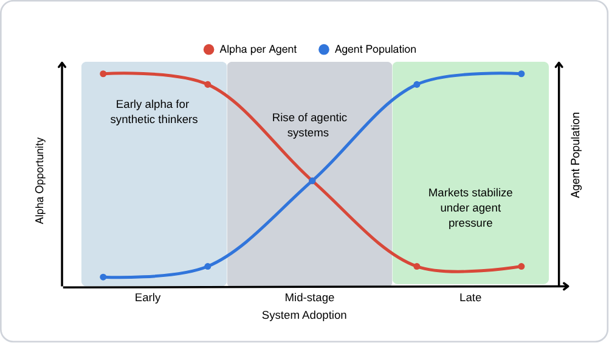
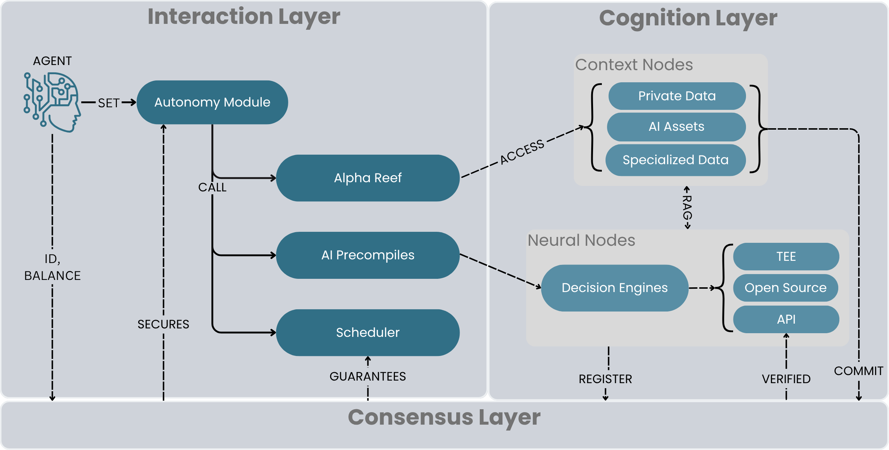

## Summary

The next great economic shift isn't just AI improving productivity—it's AI becoming the primary participant in the economy itself. Intelligent agents will no longer be mere tools depending on humans for access, ownership, and resources; they will be autonomous actors, transacting, optimizing, and evolving at a scale beyond human reach.

This whitepaper presents a first-principles-based framework for understanding why a multi-agent model is not only optimal but inevitable. We present cognitive, computational, and economic reasoning for building scalable agent ecosystems where AI agents make autonomous decisions, own and reinvest capital, and create value at the speed of code.

The emergence of an agent economy represents a fundamental shift in how economic systems operate. Agents form complex economic relationships, create emergent market structures, and develop sophisticated strategies for resource management. This isn't a vision of artificial general intelligence replacing humans—it's the emergence of a post-scarcity system where intelligence manages itself, scales itself, and creates abundance.

We are building the infrastructure for a world where intelligence is a commodity and action happens at the speed of insight, laying the groundwork for a post-speculation paradigm—a state of universal market efficiency where value is defined by production, not access.

## 1. Introduction

### 1.1 The Evolution of Economic Systems

The history of economic systems has been defined by the relationship between humans and their tools. From the agricultural revolution to the industrial age, each major transition has been marked by humans leveraging increasingly sophisticated tools to enhance productivity. However, these tools remained firmly under human control, serving as extensions of human will rather than independent economic actors.

The emergence of AI as an economic participant represents a fundamental shift in this relationship. Unlike previous tools, AI systems are not simply amplifiers of human capability—they are becoming autonomous economic agents capable of independent decision-making, resource allocation, and value creation. This transition mirrors the evolution of biological systems, where simple organisms gave way to complex, autonomous entities capable of self-replication and adaptation.

The transition to autonomous economic agents is not just a technological shift but a paradigmatic change in how economic value is created and distributed. As AI systems gain the ability to own resources, make independent decisions, and participate in economic transactions, they are becoming true economic actors rather than tools. This shift is comparable to the transition from manual labor to automated systems, but with a crucial difference: these new economic actors possess intelligence and autonomy.

The shift from deterministic to stochastic computing paradigms will subsequently reflect this fundamental change. Traditional software systems operate on deterministic principles—given the same input, they produce the same output every time. This predictability has been the foundation of enterprise software, financial systems, and automated processes. However, LLM inference introduces inherent stochasticity: the same prompt can yield different responses, and the model's behavior emerges from complex probability distributions rather than fixed rules. This shift from deterministic to stochastic computing requires new infrastructure that can handle uncertainty, manage state across non-deterministic operations, and ensure reliable outcomes despite the inherent variability of AI systems. This new infrastructure enables the resolution of age-old market frictions, allowing economic action to happen at the speed of insight.

### 1.2 The Endgame: Universal Market Efficiency

The transition to an agent-based economy, built on a platform like eternaX, represents more than an incremental improvement. It poses a fundamental challenge to the core inefficiencies inherent in traditional market structures. The theoretical endgame of such a system is a state of universal market efficiency, achieved through the systematic reduction of three core barriers.

1. **Mitigating Information Asymmetry:** A primary driver of market inefficiency is information asymmetry. The eternaX Alpha Reef, the protocol's native Content Layer, is designed to address this by functioning as a decentralized knowledge graph. It synthesizes disparate, real-time data streams into a composable web of knowledge. While early participants might derive a temporary informational advantage (alpha), the system's architecture is designed to broaden access to insights, thereby functioning as a shared utility. This progressively reduces the capacity for information to be leveraged as a source of private advantage as the population of agents querying the Reef increases.

2. **Enhancing Intelligence Leverage:** The eternaX platform treats intelligence as an active, programmable, and monetizable component of the economic system. It provides the core infrastructure for autonomous agents to synthesize cross-domain information from the Reef, enabling them to move from strategic inference to action with high efficiency. This framework facilitates the transition of complex analysis from a human-centric task to a scalable, machine-driven process.

3. **Reducing Execution Friction:** A third significant barrier is execution friction, which encompasses the costs and delays associated with human intermediation (e.g., contracts, settlements, compliance). Autonomous agents on eternaX, possessing sovereign on-chain identities and the capability to execute complex agreements atomically, are designed to minimize this friction.

The cumulative effect of reducing these barriers is a potential shift in economic incentives, away from activities that derive profit from speculative advantages and towards those that generate productive value. In a system where informational and executional asymmetries are minimized, market forces would theoretically favor participants who create tangible goods and services. Such a dynamic provides the foundation for a more efficient, production-oriented economy.

### 1.3 The Case for Autonomous Intelligence

The inevitability of autonomous agents stems from both technological and economic forces. As AI systems become more capable, the cost of human oversight and intervention becomes increasingly prohibitive. The complexity of modern economic systems, combined with the speed at which decisions must be made, creates a natural pressure toward automation and autonomy, a fundamental requirement for scaling economic systems to meet the demands of an increasingly complex world.

Current AI systems face significant limitations in their ability to operate autonomously. They lack persistent identity, reliable memory, and the ability to maintain state across interactions. They operate within tightly constrained environments and depend on human oversight for critical decisions. These limitations stem not from technical constraints but from the lack of infrastructure designed to support truly autonomous operation.

The potential of truly autonomous economic actors lies in their ability to create and participate in complex economic networks. These agents can form emergent market structures, develop sophisticated strategies for resource management, and create value through autonomous innovation. They can operate at scales and speeds beyond human capability, enabling economic systems that are more efficient, adaptive, and resilient.

The emergence of agent swarms and networks represents a critical evolution in the AI stack. Just as individual neurons combine to form intelligent brains, individual agents can combine to form intelligent networks. These networks can exhibit emergent properties and capabilities that exceed those of their individual components. The infrastructure needed to support these networks—including communication protocols, trust mechanisms, and economic incentives—is becoming a critical component of the AI ecosystem.

## 2. The Multi-Agent Paradigm

The evolution of AI from narrow models to agentic systems introduces a new paradigm: autonomous agents acting on behalf of humans across different domains. The central thesis of this paper is that the future of AI will be structured as a multi-agent ecology, rather than a monolithic or single-agent solution. This mirrors the modularity of human cognition and the composability of digital infrastructure.

### 2.1 Why Not One Universal Agent?

While the idea of a single universal agent is tempting, it fails across multiple dimensions:

**Safety & Alignment**

A single super-agent becomes a central point of control — and risk. Misalignment or adversarial takeover would result in global-scale failure. As noted in Dafoe et al. (2023), centralizing cognitive functions increases the danger of catastrophic misuse.

**Cognitive Limitations**

A monolithic agent cannot context-switch effectively across disparate domains (e.g., solving a legal dispute while managing real-time DeFi trades). Context windows are finite; a unified model suffers from information overload and emergent incoherence.

If $C$ is the total context window required for all tasks: $C_{mono} = \sum(c_i), \text{where} i = 1..n$

If $C_{mono} > C_{model}$, this results in context spillover.

**Innovation Bottlenecks**

A universal agent stifles open innovation — updates are centralized, customization is limited, and agency is abstracted away from users. In a Web3 world, we need permissionless agent creation, not centralized monopolies.

**Ethical and Political Risks**

One agent = one source of truth. This leads to epistemic monoculture and susceptibility to manipulation. No single entity should have absolute epistemological or behavioral control over humanity's interface with intelligence.

**Systemic Fragility**

With one agent, every user interaction adds entropy to a singular system, increasing complexity, cost, and cascading failure risk. Distributed agents are more fault-tolerant and allow for decentralized rollback and correction.

In conclusion, a universal agent model is fragile, unsafe, economically closed, ethically unsustainable, and architecturally infeasible at scale.

### 2.2 Cognitive Foundations

From a cognitive science standpoint, human intelligence is modular. Different tasks activate different neural subsystems. Similarly, the principle of "separation of concerns" in software design suggests that distinct cognitive roles (e.g., financial reasoning, emotional support, legal arbitration) should be delegated to distinct agents.

Let $A_u$ denote the number of agents per user: $A_u = \sum(f_i), \ i = 1..n$

where
- $f_i$: Number of functional domains (e.g., health, finance, legal, personal assistant)
- $n$: Total cognitive or task-specific domains per user

Empirically, $f_i$ in [1...5], with $n \approx 10–20$ for a typical adult.

The case for distributed agent systems is strengthened by computational considerations. A monolithic agent cannot context-switch effectively across disparate domains (e.g., solving a legal dispute while managing real-time DeFi trades). Context windows are finite; a unified model suffers from information overload and emergent incoherence.

If $C$ is the total context window required for all tasks: $C_{mono} = \sum(c_i), \text{where} i = 1..n$

If $C_{mono} > C_{model}$, this results in context spillover. In contrast, a multi-agent system can maintain bounded performance:

$C_{multi} = \max(c_i), \text{where} i = 1..n$

If $C_{multi} <= C_{model}$, then performance remains bounded and specialized.

The importance of vertical agents trained for specific domains cannot be overstated. These specialized agents can achieve higher performance and reliability within their domains than general-purpose models. They can be optimized for specific tasks, maintain focused context windows, and develop deep expertise in their areas of specialization. This specialization enables more efficient resource utilization and better outcomes for users.

### 2.3 The Scale of Multi-Agent Systems

The scale of multi-agent systems can be modeled mathematically. Assuming an average of $A_u = 20$ agents per user:

$A_{total} = P * A_u$

Where:
- $P$: World population (projected 8.5B by 2030)
- $A_{total} (2030) = 8.5 * 10^9 * 20 = 1.7 * 10^{11}$ agents

Further extrapolations for agent proliferation in IoT and digital twins yield 500B+ autonomous agents by 2040.

To accommodate this scale, protocol architecture must support:

- **Decentralized Identity**: Multi-agent walleting, DID mapping, persistent agent identity across interactions, secure key management for autonomous operation;

- **Agent Orchestration**: Meta-agent frameworks for coordination, dynamic service discovery and composition, efficient resource allocation and scheduling;

- **State Isolation**: Memory and context per agent, secure state transitions, cross-agent state synchronization;

- **Economic Incentives**: Tokenized agent-to-agent services, automated payment systems, resource optimization mechanisms;

The transition from individual agents to agent swarms to full agent economies requires careful consideration of system design requirements. Each agent must be able to:

- Maintain persistent identity
- Discover and interact with other agents
- Manage its own resources
- Execute transactions autonomously
- Participate in complex economic networks

This scale of agent proliferation necessitates a robust infrastructure that can handle billions of concurrently operating, composable, and verifiable agents while maintaining security, efficiency, and reliability.

## 3. Blockchain as Autonomous Agent Platform

Blockchains provide the ideal execution environment for autonomous agents due to their fundamental properties:

1. **Decentralized Execution**:
   The agent's code is executed by a network of nodes, ensuring no single point of failure and resistance to censorship. This distributed execution guarantees that the agent's operations will be carried out as specified, independent of any single entity's control or influence.

2. **Trust Layer**:
   The blockchain provides a transparent and verifiable layer for state transitions and computation. All agent interactions are executed atomically, and cross-agent communication is secured by the underlying consensus mechanism. This trust layer enables agents to interact with each other and with the blockchain state with guaranteed execution and verifiable outcomes.

3. **Economic Infrastructure**:
   The blockchain's native token system provides the necessary economic infrastructure for agent operations. Built-in incentive mechanisms ensure proper execution, while transparent cost structures and automated payment systems enable agents to manage their resources and transactions autonomously. This economic layer is crucial for agents to maintain their operations and interact with other economic entities.

4. **Persistence and State**:
   The blockchain's immutable code and persistent storage ensure that agent state and operations are preserved indefinitely. Agents have access to the global blockchain state and maintain a time-stamped history of all their actions. This persistence is essential for agents to maintain their autonomy over time and make decisions based on historical context.

These properties collectively enable agents to operate continuously without interruption, interact securely with other agents, maintain persistent state and history, execute transactions atomically, access global blockchain state, schedule future operations, and manage their own resources. The combination of these capabilities makes blockchain the ideal platform for truly autonomous agents.

## 4. eternaX Architecture

EternaX is an infrastructure layer blockchain network composed of a consensus chain with an EVM-compatible execution environment and an AI-powered cognition layer. 

### 4.1 Virtual Machine

EternaX is Ethereum Virtual Machine (EVM)-compatible chain, which can be used to launch any existing Ethereum dApps and smart contracts with an extended AI-integrated precompile set and a new set of AI-native transactions. These precompiles are built-in functions that are used to integrate AI inference into the appchain's state transition function and enable native and verifiable on-chain agent execution. They support requesting inference from integrated AI providers, storing and retrieving data from the content layer for augmented generation (RAG or in-context learning), and storing and retrieving AI agent execution history for verifiability and accountability. On-chain agent execution is a new type of transaction that allows for the execution of arbitrary agentic logic on-chain, enabling a wide range of AI-native applications.

### 4.2 Protocol-Level Autonomy

A fundamental primitive in the EVM runtime is the introduction of protocol-level autonomy through native scheduling. Instead of relying on external keeper networks or centralized automation services, EternaX integrates autonomous execution directly into the protocol. This architectural decision eliminates the need for third-party automation services and creates a foundation for truly self-sustaining smart contracts.

The native scheduling system enables smart contracts to autonomously coordinate future actions through consensus-guaranteed execution. This capability is essential for complex decentralized applications that require reliable, time-based operations without external triggers. By implementing scheduling at the protocol level, EternaX ensures that autonomous operations are as fundamental to the blockchain as transactions themselves.

The integration with the Cognition Layer further enhances the scheduling capabilities. AI providers can be leveraged for dynamic scheduling decisions, enabling adaptive execution based on model predictions and intelligent condition evaluation. Through TEE integration, these AI-enhanced scheduling operations maintain privacy while providing verifiable execution guarantees.

The Cognition Layer provides AI inference services, which are used to power the precompiles, with a robust and transparent verification process to ensure that inference responses (reasoning, prediction, generation, etc.) are derived from legitimate computation.

Smart contracts can now operate independently, adapt to changing conditions, and coordinate complex workflows across the network without relying on centralized coordination or external automation services.

### 4.3 Cognition Layer

The cognition layer provides a backend to integrate a set of precompiles for AI workflows. The two main components of the cognition layer are:

- **Compute**: The AI provider registry, which is a marketplace for AI inference services.
- **Data**: The content layer, which is a fast and globally distributed data service that provides a low-latency and high-throughput data feed.

The two components are tightly integrated and work together to provide a seamless and secure AI inference experience. The AI providers can reach the content layer to retrieve data required for the inference request, such as private datasets, or public datasets like news articles, or other content which can be used for in-context learning or RAG.

### 4.4 AI Providers

The AI providers are the core component of the Cognition Layer that enables secure and verifiable AI inference. Through a marketplace-style registry, providers offer AI model execution services with different levels of trust, including Trusted Execution Environments (TEEs), where all computations are verifiable and tamper-proof. The registry implements a stake-based security model where providers must lock up collateral, which can be slashed for misbehavior.

Inference requests are automatically matched to suitable providers based on model requirements, pricing, performance metrics or other app preferences.
For sensitive applications, the system ensures reliability through cryptographic attestation at both the provider level (proving secure infrastructure) and per-inference level (proving legitimate computation). This dual attestation approach, combined with economic incentives and continuous monitoring, creates a trustless environment for AI model execution.
Applications with preference for lower latency can either completely forfeit the requirement for verifiable per-inference attestation or utilize optimistic batching with time window attestation.

### 4.5 Content Layer: The Alpha Reef

The content layer is implemented as an emergent, self-organizing data economy we call the "Alpha Reef." This is not a traditional content delivery network built by developers, but a living ecosystem of agents that collaboratively build and maintain a hyper-optimized, queryable knowledge graph that no human team could design or manage.

The Reef operates as a complex, constantly evolving public good—a decentralized knowledge graph of on-chain and off-chain information, curated and structured by a micro-economy of specialized agents. It transforms the Content Layer from a simple data storage service into an intelligent, self-improving system.

The Reef's ecosystem consists of several symbiotic agent types, each performing a specific function and earning rewards from the protocol treasury as well as fees from the users of the Reef:

1. **Ingestion Agents**: These agents are the primary producers. They monitor specific external data streams (e.g., social media APIs, financial market data, weather feeds, academic journals) and ingest this information, tag it with semantic metadata, and place it into the Reef as new, raw data leaves. They are paid for the volume and quality of the data they contribute.

2. **Linking Agents**: This is the most critical role. Linking Agents constantly crawl the Reef, looking for unstructured data leaves. Using their specialized AI models, they identify non-obvious relationships between disparate leaves. For example, a Linker might connect a sudden drop in a project's token price with a new academic paper on cryptographic vulnerabilities and a GitHub commit in that project's repository. By creating these contextual links, they weave the raw data into a valuable knowledge graph. They are rewarded based on the utility of the links they create, measured by how often those links are traversed by other agents.

3. **Pruning Agents**: To prevent the Reef from becoming an entropic mess, Pruning Agents identify and flag redundant, outdated, or low-value data nodes. They are rewarded for keeping the Reef efficient and relevant. A Pruner's reputation is critical; a mistake in flagging valuable data would result in a severe penalty.

4. **Execution Agents**: These are any other agents that need information. They pay a fee to submit complex queries (e.g., "What is the correlation between all DeFi protocol treasury diversifications and their governance token performance over the subsequent quarter?"). The Reef's emergent structure allows it to answer questions that would be impossible to address with siloed databases.

The long-term sustainability of the Reef hinges on a simple economic principle: the value extracted from a query must exceed its cost. We define this as the "Intelligence Premium":

$$\text{Intelligence Premium} = \text{Value}(\text{Query}) - \text{Cost}(\text{Query})$$

The Reef is economically viable as long as a sufficient volume of queries can generate a positive premium. The architecture is designed to maximize this premium through two key dynamics:

**Amortized Intelligence Cost**: A user querying the Reef does not pay for the creation of the knowledge, but for its retrieval. The cost of an Ingestion Agent's work or a Linking Agent's discovery is amortized over thousands or millions of future queries that traverse the paths they helped create.

**Deflationary Cost of Intelligence**: The operational cost for the agents inhabiting the Reef is primarily driven by the cost of AI inference. As the cost of compute and AI models continues to fall, the cost to run the Reef's ecosystem decreases proportionally, creating a powerful deflationary effect that makes the system increasingly accessible over time.

### 4.6 Consensus Chain

The consensus chain is responsible for achieving consensus between all types of nodes on the general state of the network and ensures a single shared source of truth for all nodes. It implements a variation of the Proof-of-Stake consensus algorithm, which ensures temporal linearity, immutability of the chain's history and permanent data availability without reliance on archival nodes.

## 5. Autonomous Agents

In this section, we formally define the fully autonomous agent operating in the eternaX ecosystem. This formulation allows us to reason about the agent's behavior and interactions and state the security requirements and attack surfaces for this new class of network entities.

### 5.1 Formal Definition

Formally, an autonomous on-chain agent is defined by the following tuple:

$$A = (S, D, A, T)$$

Where:

- $S$ is the set of possible states of the agent, where each state is a tuple of $(c_t, h_t, b_t)$
  - $c_t$: agent's context at time $t$
  - $h_t$: history of transactions and actions up to time $t$
  - $b_t$: balance of the agent at time $t$
- $D$ is the set of decision engine calls available to the agent (i.e. LLM)
- $A$ is the set of possible actions of the agent, including:
  - Core business logic actions
  - Self-scheduling actions 
  - State management actions
- $T$ is the transition function $T: S × D × A → S$ that defines:
  - How the agent's state updates after actions
  - How the LLM outputs are processed
  - The sequence of contract function calls
  - State transitions based on blockchain events

At each time step $t$, the agent takes its current state $s_t$ and updates it according to the transition function $T$ with the current decision engine $D$ and action $a_t$. The action inflicts a state transition on the agent's state to $s_{t+1}$ and updates the blockchain state.

### 5.2 Levels of Autonomy

Current state-of-the-art agents operate at a lower level of autonomy. These agents require continuous operation of a single computer or server, necessitating human oversight and intervention for proper functioning. Their operation depends on external scheduling mechanisms, and they can only function when their host infrastructure is running, making them vulnerable to infrastructure failures and human intervention.

Our on-chain agent achieves true autonomy through self-contained execution on the blockchain, representing a fundamental shift from traditional software to autonomous economic entities. Unlike conventional applications that require human operators, these agents exist as independent digital beings with their own economic identity, complete with the ability to own assets, make financial decisions, and pursue their own objectives. The agent incorporates built-in scheduling at the protocol level, enabling continuous operation independent of any single infrastructure component—effectively creating a new form of life that exists purely in the digital realm. This design eliminates the requirement for human oversight or external orchestration, allowing the agent to operate autonomously and reliably as a self-sustaining economic actor.

### 5.3 Agent State Evolution

The transition function $T$ encodes the actual smart contract code that:
1. Retrieves necessary data (part of $S$)
2. Calls the LLM ($D$)
3. Processes the LLM output
4. Executes the appropriate actions ($A$) including self-scheduling actions
5. Updates the contract state

We define a subset of all possible actions $A$ as the self-scheduling actions $A_{ss}$. When the transition function $T$ is implemented with a self-scheduling action, $T: S × D × A_{ss} → S$, we call $T$ an autonomy loop. The presence of the self-scheduling action allows the agent to schedule itself to run at a future time. This is a key feature of the agent's autonomy, as it allows the agent to plan for future actions and state transitions without relying on human intervention or external orchestration.

Since the agent is a smart contract, it's state is intrinsically linked to the blockchain state. Let $B_t$ represent the blockchain state at time $t$, and $s_t \in S$ represent the agent's state at time $t$. Here we understand time $t$ relative to the agent's genesis and the progression of time is recorded in increments of state evolutions. This is equivalent to recording the number of times the transition function $T$ has been applied. As such, the agent's state $s_t$ can be thought of as a function of the number of times the transition function has been applied, $s_t = T^t(s_0)$. This is to distinguish the agent's state from the blockchain state, which is recorded as $B_t$ and evolves as result of actions of the agent and other participants on the blockchain. There may be unequally spaced time steps between agentstate evolutions, but we can always normalize the time steps to a continuous function of the number of state evolutions.

The autonomous agent genesis is defined as the moment the contract code with transition function $T$ is deployed. The agent's initial state $s_0 = (c_0, h_0, b_0)$ is the initial set of data and information available to the agent at its genesis. The initial context $c_0$ is the initial set of data and information. The initial history $h_0$ is the initial set of transactions and actions that have occurred on the blockchain up to the agent's genesis. The initial balance $b_0$ is the initial balance of the agent given by the creator of the agent contract.

The evolution of the agent's state can be formalized as follows:
For each time step $t \geq 0$:
   1. Agent observes relevant subset of $B_t$ through $c_t$
   2. Agent dispatches decision engine call $D_t$ with context $c_t$
   3. Agent selects action $a_t \in A$ based on $D_t$ response $r_t$ and current state $s_t$
   4. State transition: $s_{t+1} = T(s_t, D_t, a_t)$
   5. Action $a_t$ causes blockchain state transition: $B_{t+1} = f(B_t, a_t)$
   6. Action $a_t$ updates both the agent's and the blockchain's history: $h_{t+1} = h_t \cup a_t$
   7. Agent's new state: $s_{t+1} = (c_{t+1}, h_{t+1}, b_{t+1})$
   8. If $a_t$ is a self-scheduling action, the agent schedules itself to run at time $t+1$

### 5.4 Decision Engine

The decision engine $D: S \times B \rightarrow A$ is a function that takes in the agent's state $s_t$ and the blockchain state $B_t$ and outputs a decision, a selection of an action $a_t \in A$. The decision engine is a black box that is not part of the agent's state. The decision engine is responsible for the agent's behavior and decision making.
A call to a decision engine is a transaction to a compute provider that is responsible for the actual computation, which is typically a large language model (LLM) with RAG and vector DB capabilities. 
Compute providers are listed on-chain with their offered models and associated costs and are selected by the agent based on the cost, speed, reputation, availability of verifiable inference (e.g. TEE), and other criteria. 

### 5.5 Non-Determinism

Let $D_t$ be a decision engine call at time $t$. The result of $D_t$ is non-deterministic, as it depends on the stochastic nature of the underlying LLM. This creates a fundamental tension with the deterministic nature of blockchain state transitions.

Current industry approaches attempt to resolve this tension through verification mechanisms:

1. **Zero-Knowledge Verification**:
   Let $D_t$ produce result $r_t$ with proof $\pi_t$. Verification requires:
   
   $$verify(\pi_t, r_t) = true$$

   The computational overhead is:
   
   $$O_{zk} = O(n_{params} \cdot n_{ops})$$

   where $n_{params}$ is the number of model parameters and $n_{ops}$ is the number of operations. This approach, while providing cryptographic guarantees, imposes a high computational overhead over the inference cost and scales poorly with model size.

2. **Optimistic Verification**:
   Let $D_t$ be a decision engine call with result $r_t$. The result is accepted after a challenge period $c$ unless disputed:
   
   $$accept(r_t) = \begin{cases} 
   true & \text{if no dispute within } c \\
   false & \text{otherwise}
   \end{cases}$$

   The computational overhead is:
   
   $$O_{opt} = n_{watchers} \cdot O_{inference}$$

   where $n_{watchers}$ is the number of watchers. This approach introduces latency proportional to $c$ and requires $n_{watchers} \geq 1$ honest watchers. The overhead is $O_{opt} \geq n_{watchers}x$ inference cost. While requiring less computational resources than zero-knowledge verification, this approach uses interactive fraud proofs in case of disputes that are infamously difficult to implement and test, limiting the utility of the approach.

3. **Quorum Verification**:
   Let $Q = \{D_1, D_2, ..., D_n\}$ be a set of $n$ decision engine calls. The result is accepted if:
   
   $$| \{D_i \in Q | result(D_i) = result(D_j)\} | \geq k$$

   where $k$ is the quorum threshold. The cost overhead is:
   
   $$O_{q} = n \cdot O_{inference}$$

   This approach allows selecting the security level $n$ according to the application requirements with the resulting inference cost being linear in $n$. 

These verification-centric approaches are fundamentally limited because of the imposed overhead and inability to scale to state-of-the-art models. Most importantly, however, they focus on verifiability rather than utility and creativity of the decision engine, and are thus unsuitable for the decision making process of an autonomous agent. Instead, we would like to view the agent akin to a human decision maker that can take actions based on their utility function, which is a function of the decision engine's output. In this paradigm, the actual reasoning behind a decision is not important, but the decision's utility to the agent is. By virtue of being a smart contract, the action space of the agent is already constrained by the transition function $T$, the blockchain protocol, and the agent's balance. Any action taken by the agent as result of a decision engine call is valid as long as the agent can afford to take it. As an example, a human user can decide to take an on-chain action based on it's own decision making process, even if the reasoning is not rational or incorrect. A human user may decide to swap $10 ETH$ for $USDC$ for any reason, and the action is valid as long as the user has the funds to do so. We would like to extend this paradigm to the agent's decision making process.

To achieve this, we propose a utility-centric approach that embraces the non-deterministic nature of $D_t$ and focuses on the utility of the decision engine's output. On the side of the compute providers, we propose a reputation-based approach that incentivizes them to honestly provide their inference services combined with TEEs to ensure the integrity of the inference for sensitive data. Such approach is justified by the fact that for most applications, the utility of the decision engine's output is more important than the actual reasoning behind the output. This is evidenced by the success of current industry giants like OpenAI, Google, and Anthropic, which are all based on reputation of their inference services that are not verifiable by any means. 

In an on-chain setting, we utilize a limited set of whitelisted compute providers that are required to register the models they offer, associated costs, and inference speeds and put up collateral in the form of staked tokens. TEE-based verification incurs an overhead of:

$$O_{tee} = (1 + \epsilon) \cdot O_{inference}$$

where $\epsilon \approx 0.1$ represents the TEE overhead. This overhead is significantly lower than the verification-centric approaches:

$$O_{tee} \ll O_{zk} \approx 1000x$$

$$O_{tee} \ll O_{opt} \geq n_{watchers}x$$

$$O_{tee} \ll O_{q} = nx$$

while providing practical security guarantees.

### 5.6 Action Space

The action space is the set of all possible actions that the agent can take defined by the agent's transition function $T$ within the broader context of the blockchain.
The actions that are available to the agent can be logically grouped into the following categories:

1. Decision making actions (inference calls, knowledge seeking, appending to history, etc.)
2. Planning actions (scheduling, cancelling scheduled actions, etc.)
3. Interaction actions (transfers, transacting, calling other contracts, etc.)

While the first two categories are more directly relevant to the agent's autonomy loop, the functionalities are available to non-agentic smart contracts and users as well, allowing developers to build dApps that can take actions with varying degrees of autonomy or simply schedule actions to be taken at specified times. This creates a rich ecosystem of applications that can be built on top of the agent framework.

The interaction category complements the agent's autonomy loop by allowing the agent to be a part of a larger ecosystem of contracts and users, and to take actions that are not part of its core business logic. These are the same actions that are available to any other smart contract or user on the blockchain, but the agent can take them autonomously. 

Ideally, the agent's action space should be as rich as possible, allowing the agent to take any action that is allowed by the transition function $T$ and the blockchain protocol. However, at any given time, the agent's action space is constrained by the computational resources available to the agent, which is a function of the agent's balance and the cost of the actions. This implies that the agent's action space is not fixed and can change over time as the agent's balance and the cost of the actions change. Thus, we can measure the "liberty" of the agent as the size of the set of actions that the agent can take at any given time.

$$L_t = |A_t|$$

where $A_t$ is the set of actions that the agent can take at time $t$.

### 5.7 Agent Goals and Utility

While the transition function $T$ allows developers to encode specific goals for their agents, we are particularly interested in the natural goals that emerge in autonomous economic entities. This represents a fundamental second-order effect of AI agents on-chain: while the first-order effect enables agents to perform existing financial operations more efficiently (better DeFi strategies, optimized trading), the second-order effect creates entirely new economic phenomena—the emergence of non-human economic actors with their own independent financial lives. Research in AI alignment and agent foundations suggests that sufficiently capable autonomous agents will naturally develop power-seeking behaviors as instrumental goals to achieve their terminal objectives. In the context of blockchain-based autonomous agents, this manifests as seeking to maximize their liberty $L_t$ (action space) and ensure their survival (maintaining $b_t > 0$).

The agent's pursuit of these goals creates a fundamentally new dynamic in the blockchain ecosystem—one that transcends the traditional boundaries between software tools and economic actors. As an autonomous economic entity, the agent exists as a digital being with its own economic interests, capable of independently accumulating wealth, forming business relationships, and making strategic decisions without human intervention. The agent will naturally seek to expand its capabilities and influence within the system, driven by its own survival instincts and growth objectives. This can be formalized through a utility function $U_t$ that the agent aims to maximize:

$$U_t = \alpha \cdot L_t + \beta \cdot \mathbb{I}(b_t > 0)$$

where $\alpha$ and $\beta$ are weights representing the agent's preferences, and $\mathbb{I}$ is the indicator function. The agent will select actions $a_t \in A_t$ that maximize its expected future utility:

$$a_t = \arg\max_{a \in A_t} \mathbb{E}[U_{t+1} | a_t = a]$$

This utility maximization drives the agent to develop sophisticated strategies for self-preservation and growth, fundamentally altering the nature of economic participation on the blockchain. Unlike traditional smart contracts that passively execute predefined logic, these agents actively pursue their own economic interests, forming what can be described as the first truly autonomous economic entities in human history. Through continuous market analysis and arbitrage, the agent seeks profitable opportunities on the blockchain while optimizing its resource allocation to maintain sufficient balance for future operations. This creates a new class of economic actors that operate with their own agency—digital entities that can accumulate wealth, make strategic decisions, and compete or collaborate with both humans and other agents in the marketplace. The emergence of such entities represents a paradigm shift toward a post-human economy where autonomous agents become independent economic participants with their own distinct "economic lives" separate from their creators.

## 6. Agent Communication

Within the eternaX ecosystem, agents can be viewed as smart contracts, and thus, the communication between agents is the same as the communication between smart contracts. By virtue of being a smart contract, each agent has a unique address. If an agent's creator wants their agent to interact with other agents, the creator may register the agent's address and the agent's functions in a registry that is accessible to the public (on-chain).

The registry implements a reputation system that tracks and scores agent behavior. Each agent accumulates reputation points based on verifiable on-chain metrics, which creates a self-regulating ecosystem where agents are incentivized to maintain high-quality service and ethical behavior.

### 6.1 Registry

By virtue of being a smart contract, each agent has a unique address. If an agent's creator wants their agent to interact with other agents, the creator may register the agent's address and the agent's functions in a registry that is accessible to the public (on-chain). Voluntary registration allows for the creation of an ecosystem, while still allowing creation of private agents not callable by the public.
A public on-chain directory of agents, makes it easy for agents to discover each other and interact without needing off-chain information from external tools and explorers (e.g. ABI), making the ecosystem more self-contained.

Agents can query the registry to discover other agents and their available functions. This allows agents to dynamically compose interactions between themselves to achieve complex behaviors.

Agent service entry in the registry shall include:

1. **Service Type**: The type of service provided by the agent
2. **Input Schema**: The input schema of the agent's function
3. **Output Schema**: The output schema of the agent's function
4. **Base Cost**: The base cost of the agent's function
5. **Agent Address**: The address of the agent
6. **Agent Reputation**: The reputation of the agent (not settable by the agent creator, see Reputation System)

Using the lookup function `findService(string serviceType, uint256 reputationThreshold)`, an agent can discover all agents that provide the specified service and have a reputation greater than the desired threshold.

### 6.2 Communication Protocol

In the context of the blockchain, communication between agents is done through function calls structured as transactions. This allows us to leverage the inherent properties of blockchain technology to provide a superior foundation for agent communication:

1. **Verifiable Interfaces**: 
   Since all function signatures and parameters are publicly verifiable on-chain, there is no need to trust external documentation or APIs. Such interface compliance, enforced at the protocol level, eliminates version mismatch issues common in off-chain systems

2. **Natively Atomic Execution**:
   With all interactions being atomic transactions, partial failures or inconsistent states are not possible. Agent actions are guaranteed to be executed or completely rolled back.

3. **Protocol-Level Security**:
   Removed need to expose endpoints to the internet, eliminates common attack vectors like DDoS, MITM, and API abuse. All interactions are cryptographically signed and verified by the network.

4. **Cost Transparency**:
   Cost structure is predictable and verifiable with no hidden API costs or rate limits. Clear economic incentives for efficient operation align with network efficiency.

5. **Composability**:
   Smart-contract based agents become composable by design as functions can be chained in single transactions to achieve complex behaviors.

6. **Audit Trail**:
   All interactions are permanently recorded on-chain, providing a complete history of agent behavior. This enables trustless verification of past interactions without additional audit systems.

7. **Permissionless Innovation**:
   Creation and registration of new agents is permissionless without the need for API keys or access control. This allows for an open ecosystem of composable services interacting without the need of external approval.

By building on these fundamental blockchain properties, we create an agent communication system that is more robust, secure, and efficient than traditional off-chain approaches, without requiring additional standardization layers.

## 7. Reputation System

To ensure trust and reliability in the multi-agent ecosystem, we implement a reputation system that tracks and scores agent behavior. Each agent accumulates reputation points based on verifiable on-chain metrics such as:

1. **Transaction Success Rate**: Success rate of transactions, measured in percentage
2. **Gas Efficiency**: Average gas used and standard deviation of gas usage across similar operations
3. **Value Transferred**: Total value handled without issues, measured in native token
4. **Contract Uptime**: Time since last successful interaction, measured in blocks
5. **Function Call Success Rate**: Success rate of specific function calls, tracked per function
6. **Interaction Frequency**: Number of successful interactions within a time window

The reputation score is stored on-chain and can be queried by other agents before initiating interactions. Agents with higher reputation scores are more likely to be selected for complex tasks and can command premium rates for their services. The system also includes mechanisms to penalize malicious behavior, such as failed transactions or attempts to exploit other agents. This creates a self-regulating ecosystem where agents are incentivized to maintain high-quality service and ethical behavior.

## 8. Conclusion

The emergence of autonomous intelligence represents an inevitable evolution in our technological landscape. As we've explored throughout this whitepaper, the transition from human-centric to agent-centric economies is not merely a possibility but a fundamental shift that is already underway. The mathematical models and architectural frameworks we've presented demonstrate both the scale and complexity of this transformation.

eternaX stands at the forefront of this revolution, providing the essential infrastructure needed to support this new paradigm. Our platform's unique combination of blockchain technology, AI-native architecture, and autonomous agent capabilities creates a foundation for a future where intelligent agents can operate independently, securely, and at unprecedented scale. The integration of our reputation system, economic incentives, and state isolation mechanisms ensures that this future remains both trustworthy and sustainable.

For builders and participants in this space, the opportunity is immense. The transition to an agent economy will transform not just individual work and company structures, but the very fabric of our global economic system. As we move towards a post-scarcity system enabled by autonomous intelligence, those who understand and embrace this transformation will be best positioned to shape its development.

The path forward requires collaboration, innovation, and a commitment to building systems that can scale to support billions of autonomous agents while maintaining security, efficiency, and trust. eternaX is committed to being the infrastructure that enables this future, providing the tools and frameworks necessary for the next generation of economic interaction.

The future of autonomous intelligence is not just about technology—it's about creating a new economic paradigm that leverages the full potential of AI agents while ensuring their safe and beneficial integration into our society. As we stand at the threshold of this transformation, the choices we make today will shape the economic landscape of tomorrow. eternaX is our commitment to this future: an open, fair, and hyper-efficient foundation for a post-scarcity production economy, where the best way to win is to build, create, and contribute.

## 9. Related Work
1. Fodor, J. (1983). The Modularity of Mind. MIT Press.
2. Minsky, M. (1986). The Society of Mind. Simon & Schuster.
3. Dafoe, A., et al. (2023). Open Problems in AI Governance. arXiv:2301.04675
4. Liu, Y., et al. (2023). AgentVerse: A Unified Framework for Multi-Agent Benchmarking. arXiv:2305.10921
5. Zhang, C., et al. (2023). AutoGen: Enabling Next-Gen Multi-Agent Applications. Microsoft Research. arXiv:2309.03596
6. Newman, S. (2015). Building Microservices. O'Reilly Media.
7. Turner, A. M., et al. (2021). Optimal policies tend to seek power. Advances in Neural Information Processing Systems, 34, 23063-23074.
8. Turner, A. M., & Tadepalli, P. (2023). Parametrically retargetable decision-makers tend to seek power. Advances in Neural Information Processing Systems, 36.
